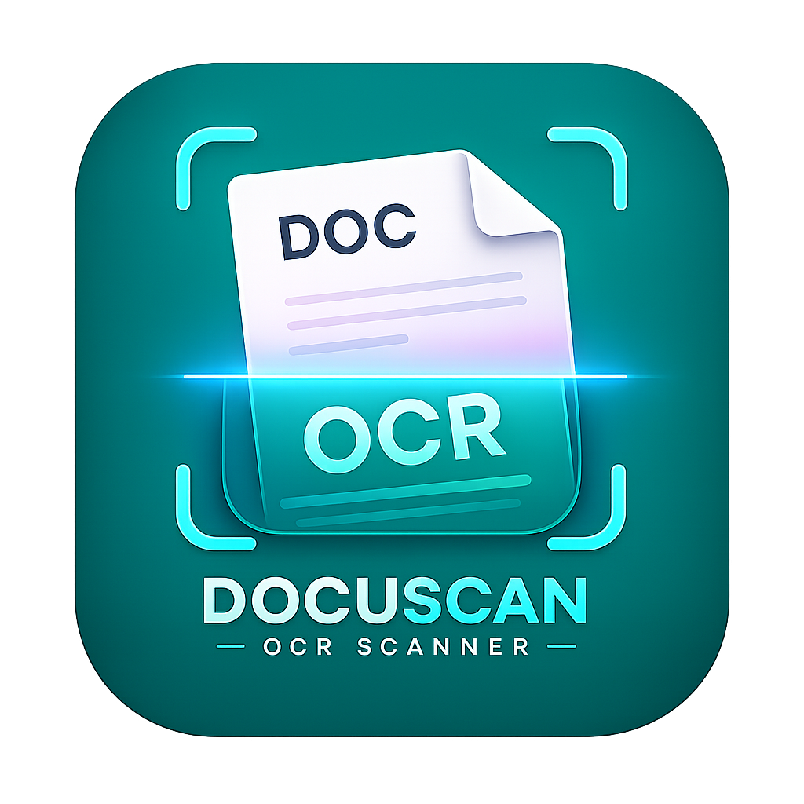

# 📄 DocuScan OCR 2.0.0

<p align="center">
  
</p>

<p align="center">
  <strong>On-device document scanning &bull; Real ML Kit OCR &bull; AES-GCM encryption &bull; 3-cloud sync</strong>
</p>

<p align="center">
  <a href="#-features"></a>
  <a href="#license"></a>
  <a href="https://github.com/Rishav7324/DocuScan-OCR/releases"></a>
  <a href="https://kotlinlang.org/"></a>
  <a href="#-ci-cd"></a>
  <a href="https://developer.android.com/jetpack/compose"></a>
  <a href="#-security-model"></a>
  <a href="#-dependencies"></a>
  <a href="https://github.com/Rishav7324/DocuScan-OCR/issues"></a>
  <a href="https://github.com/Rishav7324/DocuScan-OCR/actions/workflows/ci.yml"></a>
</p>

---

## 📋 Table of Contents

- [Overview](#-overview)
  - [Why DocuScan OCR?](#why-docuscan-ocr)
  - [Who It Is For](#who-it-is-for)
  - [What Changed in 2.0.0](#what-changed-in-200)
- [Features](#-features)
  - [Live Camera Capture](#-live-camera-capture)
  - [On-Device OCR (ML Kit)](#-on-device-ocr-ml-kit)
  - [Adaptive Perspective Correction](#-adaptive-perspective-correction)
  - [Secure Folder Lockboxes](#-secure-folder-lockboxes)
  - [Multi-Format Export](#-multi-format-export)
  - [Persistent Audit Logging](#-persistent-audit-logging)
  - [Multi-Cloud Sync](#-multi-cloud-sync)
  - [Five Built-In Themes](#-five-built-in-themes)
- [Screenshots & Visual Preview](#-screenshots--visual-preview)
- [Technical Stack](#-technical-stack)
- [Architecture](#-architecture)
  - [MVVM Data Flow](#mvvm-data-flow)
  - [Database Schema](#database-schema)
  - [Package Map](#package-map)
- [Security Model](#-security-model)
  - [Key Hierarchy](#key-hierarchy)
  - [Folder PIN Flow (Step by Step)](#folder-pin-flow-step-by-step)
  - [File Encryption](#file-encryption)
  - [Threat Model](#threat-model)
  - [PBKDF2 Iteration Count Rationale](#pbkdf2-iteration-count-rationale)
- [Cloud Sync Providers](#-cloud-sync-providers)
  - [Cloudflare R2 (S3 API + SigV4)](#1-cloudflare-r2-storage-setup-s3-api--sigv4)
  - [Google Drive (OAuth 2.0, Drive v3)](#2-google-drive-backup-1-click-oauth)
  - [Dropbox (OAuth 2.0 + PKCE)](#3-dropbox-integration-1-click-oauth--pkce)
  - [OneDrive (Coming Soon)](#4-onedrive-coming-soon)
- [Encryption & Key Management](#-encryption--key-management)
  - [Algorithm Reference](#algorithm-reference)
  - [PBKDF2 Key Derivation Code Path](#pbkdf2-key-derivation-code-path)
  - [AES-GCM File Encryption](#aes-gcm-file-encryption)
  - [OAuth Token Storage](#oauth-token-storage)
- [Export Formats](#-export-formats)
  - [PDF (Platform PdfDocument)](#pdf-platform-pdfdocument)
  - [DOCX (Custom OOXML)](#docx-custom-ooxml)
  - [TXT (Plain Text)](#txt-plain-text)
- [Audit Logging & Compliance](#-audit-logging--compliance)
  - [Audit Event Types](#audit-event-types)
  - [Compliance Screen](#compliance-screen)
  - [Compliance Notice](#compliance-notice)
- [CI/CD](#-ci-cd)
  - [Workflow Reference](#workflow-reference)
  - [Secrets Reference](#secrets-reference)
  - [Release Process](#release-process)
- [Building the Code](#-building-the-code)
  - [Prerequisites](#prerequisites)
  - [Quick Start](#quick-start)
  - [Release Build](#release-build)
  - [OAuth Client Registration](#oauth-client-registration)
- [Migration Guide: 1.0.0 to 2.0.0](#-migration-guide-100-to-200)
- [Dependencies](#-dependencies)
  - [Runtime Dependencies](#runtime-dependencies)
  - [Test Dependencies](#test-dependencies)
  - [Removed Dependencies](#removed-dependencies)
- [Project Structure](#-project-structure)
- [Performance & Benchmarks](#-performance--benchmarks)
- [Troubleshooting](#-troubleshooting)
- [FAQ](#-faq)
- [Contributing](#-contributing)
  - [Development Setup](#development-setup)
  - [Pull Request Guidelines](#pull-request-guidelines)
  - [Roadmap](#roadmap)
- [License](#-license)

---

## 🔭 Overview

DocuScan OCR is an **offline-first, privacy-respecting document scanning application** for Android. Every scan you take is processed **entirely on your device** — optical character recognition, perspective correction, image filtering, encryption, and export all happen locally. No images ever leave your device unless you explicitly sync to a cloud provider you control.

The application was redesigned from the ground up in version 2.0.0 to remove all simulated or placeholder functionality. There are no fake documents, no mocked API calls, and no AI cloud dependencies. Everything is real.

---

### Why DocuScan OCR?

Most document scanner apps on the Play Store follow one of these patterns:

1. **Cloud OCR scanners** (Adobe Scan, Microsoft Lens, Google Drive scanner) — Upload your document images to a cloud server for text recognition. This means your sensitive documents (passports, contracts, medical records) leave your device and are processed on infrastructure you do not control.

2. **Subscription-gated scanners** (CamScanner, Scanner Pro) — Core features like high-resolution export, cloud sync, and OCR are behind a monthly or yearly paywall. Free tiers show ads and watermark your documents.

3. **Proprietary-format lock-in** — Scans are stored in a format that only works inside that app. Migrating your documents to another system is difficult or impossible.

DocuScan OCR takes a fundamentally different approach:

- **OCR is on-device.** The ML Kit text recognizer runs the same neural network models on your phone that it would run on a server. The camera image is consumed by the model directly in your app's process. No data leaves the device.

- **Encryption uses your device's hardware.** Folder PINs are derived into encryption keys via PBKDF2 and AES-GCM. The master key lives in the Android Keystore — a dedicated secure processor on modern phones. Even if the APK is decompiled and the SQLite database is extracted, the encrypted files remain confidential.

- **Cloud sync goes to *your* accounts.** The app does not maintain a backend server. You provide your own Cloudflare R2 bucket, Google Drive account, or Dropbox app folder. There is no intermediary, no monthly subscription, and no data mining.

- **Exports are open standards.** PDF (embedded images + text overlay), DOCX (valid OOXML that opens in any word processor), and TXT (plain UTF-8). You can at any point stop using the app and keep all your documents.

---

### Who It Is For

- **Privacy-conscious professionals** who do not want their contracts, medical records, or identification documents sent to a cloud AI for processing.

- **Small medical, legal, and accounting practices** that need a lightweight compliance-ready scanning tool with audit trails and at-rest encryption (note: this is not a certified HIPAA/GDPR product — see the [Compliance Notice](#compliance-notice)).

- **Developers and tinkerers** who want an open-source, auditable scanning stack with a modern Jetpack Compose UI, MVVM architecture, and minimal dependencies.

- **Anyone who wants real OCR, real encryption, and real cloud sync** without paying a monthly subscription or trusting a third-party server with their documents.

---

### What Changed in 2.0.0

Version 2.0.0 is a comprehensive rewrite that removes all simulated functionality and replaces it with real implementations:

| Area | 1.0.0 (Old) | 2.0.0 (Current) |
|------|-------------|------------------|
| **Camera** | `GetContent` gallery picker only; shutter generated fake bitmaps via `generateSimulatedDocument()` | Real CameraX `PreviewView` + `ImageCapture.takePicture()` |
| **OCR** | ML Kit (used but results were disconnected) | Full integration: `OfflineOcrService` processes captured bitmaps, stores recognized text per page |
| **Encryption** | Unclear/placeholder | Android Keystore master key + PBKDF2-HMAC-SHA256 (100k iters) + AES-256-GCM file encryption |
| **Cloud Sync** | Simulated with fake tokens | Real uploads via SigV4 (R2), Drive v3 API (Google), files/upload (Dropbox). Real OAuth PKCE flows. |
| **Dependencies** | ~15+ including Firebase, Retrofit, Moshi, Coil, Credentials libraries | 7 runtime deps — all unused deps removed |
| **OAuth** | None (simulated tokens) | Browser-based PKCE for Google Drive + Dropbox with token refresh |
| **CI/CD** | Single broken release workflow | 5 workflows: CI, Release (signed APK + AAB), CodeQL, PR checks, Dependabot |
| **App Icon** | Android Studio placeholder (green grid) | Real icon from `assets/app_icon.png` generated at all densities with adaptive + round variants |
| **README** | 5500 bytes, ~98 lines | Full enterprise documentation |

---

## ✨ Features

### 📸 Live Camera Capture

The shutter button no longer generates fake documents. It captures a real photograph using **CameraX** (`ImageCapture.use()`) with the following pipeline:

```
Camera sensor → ImageCapture.takePicture() → ImageProxy
                                                     │
                                            ImageProxy.toBitmap()
                                              (rotation-corrected via
                                               imageInfo.rotationDegrees)
                                                     │
                                                     ▼
                                          addImageToBatch(bitmap)
```

`ImageProxy.toBitmap()` decodes the JPEG bytes from the `ImageProxy` plane buffer and applies the sensor rotation so the image is always upright. The `CameraX PreviewView` fills the viewfinder with a live feed from the device's back camera, scaled to `FILL_CENTER`.

Permissions are requested at runtime via `ActivityResultContracts.RequestPermission()` with a LaunchedEffect on first composition. If permission is denied, the camera preview area shows a fallback UI with a "Grant Permission" button.

The gallery **Import** button is preserved alongside the live camera — use it to import existing images from the device gallery for OCR and processing.

---

### 🔍 On-Device OCR (ML Kit)

Text recognition runs entirely on-device through **Google ML Kit Text Recognition — Latin** (`TextRecognizerOptions.DEFAULT_OPTIONS`). The `OfflineOcrService` is a singleton that wraps the ML Kit client:

```kotlin
class OfflineOcrService {
    private val recognizer = TextRecognition.getClient(TextRecognizerOptions.DEFAULT_OPTIONS)

    suspend fun recognizeText(inputImage: InputImage): Result<String> = withContext(Dispatchers.Default) {
        runCatching {
            val visionText = recognizer.process(inputImage).await()
            visionText.textBlocks.joinToString("\n\n") { block ->
                block.lines.joinToString("\n") { it.text }
            }
        }
    }
}
```

Key characteristics:

- **No network.** The ML Kit model is bundled with the app or downloaded on first use via Google Play Services. Once downloaded, all recognition runs locally.
- **Latin script only.** The default options target Latin-based languages (English, Spanish, French, German, etc.). For CJK (Chinese, Japanese, Korean) or other scripts, change to `TextRecognizerOptions.FORCE_OPTIONS` with the appropriate model.
- **Coroutine-friendly.** `recognizer.process()` returns a `Task<VisionText>`. We use `kotlinx-coroutines-play-services`'s `.await()` extension to bridge the callback-based API into a suspend function.
- **Per-page storage.** The recognized text is stored in `PageEntity.ocrText` and can be searched, exported, or re-displayed without re-running OCR.

---

### 📐 Adaptive Perspective Correction

The perspective correction pipeline has three stages:

**Stage 1: Auto Edge Detection (`AutoCornerDetector.kt`)**

The detector scans the image along diagonal paths from each corner toward the center, looking for sharp luminance transitions that indicate a document edge. It uses an adaptive threshold that accounts for varying lighting conditions. The output is four corner coordinates approximating the document boundaries.

**Stage 2: Manual Adjustment (`InteractiveCropper.kt`)**

A Compose Canvas renders the image with four draggable corner handles. The user can fine-tune the corners detected in Stage 1. Touch handling uses `Modifier.pointerInput` with `detectDragGestures` for smooth, frame-rate interaction.

**Stage 3: Warp & Filter (`CropCorrectionScreen.kt` + `DocumentFilterProcessor.kt`)**

The selected quadrilateral is perspective-warped to a flat rectangle using `Bitmap.createBitmap()` with a `Matrix` that applies the perspective transform. After warping, the user can apply one of five image filters:

| Filter | Implementation | Use Case |
|--------|---------------|----------|
| **Lighten** | `ColorMatrix` with increased brightness | Underexposed scans, backlit documents |
| **Darken** | `ColorMatrix` with decreased brightness | Faint pencil text, washed-out receipts |
| **High Contrast** | `ColorMatrix` with saturation boost + contrast stretch | Fax-quality documents, carbon copies |
| **Black & White** | `ColorMatrix` with saturation=0 and threshold | Archival scans, OCR pre-processing |
| **Grayscale** | `ColorMatrix` with saturation=0 | Removing color noise while preserving luminance |

Each filter is applied via `Canvas.drawBitmap()` with a `ColorMatrixColorFilter` on the paint, making the operation GPU-accelerated through Android's hardware-accelerated Canvas pipeline on API 28+.

---

### 🗂️ Secure Folder Lockboxes

Folders can be marked as **private** and protected with a 4-digit PIN. The full security architecture is described in the [Security Model](#-security-model) section, but the high-level flow is:

1. User creates a folder, checks "Private", enters a 4-digit PIN.
2. A random 16-byte salt is generated. The PIN + salt are stretched through PBKDF2 (100,000 iterations) to produce a 256-bit AES key.
3. The string `"VERIFIED"` is encrypted with that key and stored as the folder's `pinHash`.
4. Documents created inside this folder have their page images encrypted at rest using the same key derivation mechanism but with per-file salts.
5. When the user opens the folder, they enter the PIN (or authenticate via biometrics — see `BiometricLock.kt`). The PIN is compared by attempting to decrypt the `"VERIFIED"` marker. On success, the PIN is held in `ScannerViewModel.activeFolderPin` StateFlow.
6. When the app goes to the background, `activeFolderPin` is cleared.

**What happens to encrypted files when the PIN is forgotten?** They are **irrecoverably lost**. There is no backdoor, no password reset, no cloud recovery. This is a deliberate design choice — if the encryption is to be meaningful against a physical attacker, there must be no way to bypass it.

---

### 📤 Multi-Format Export

Export any document to one of three formats. Each exporter is a standalone standalone function in `ExportUtils.kt` that takes a `File` reference and writes the output:

**PDF** — `android.graphics.pdf.PdfDocument`. Each page is rendered as a bitmap on a 1008×2016 point canvas. The page image is drawn first, then the OCR text is overlaid on top using `Canvas.drawText()`. The document is written to `$EXTERNAL/DocuScan/exports/`.

**DOCX** — Custom OOXML implementation. A `.docx` file is a ZIP archive containing XML parts. The exporter creates the minimum required structure: `[Content_Types].xml` (lists the document parts) and `word/document.xml` (contains the OCR text in a single `<w:body>` paragraph). The implementation is ~40 lines and produces valid documents that open in Word, Google Docs, and LibreOffice.

**TXT** — Simple UTF-8 text file with OCR output, one text block per paragraph separated by double newlines.

All formats are shared via the system share sheet using a `FileProvider` + `Intent.ACTION_SEND`, so the output file can be emailed, uploaded to any service, or saved anywhere on the device.

---

### 📝 Persistent Audit Logging

Every data-modifying action is recorded in the `audit_logs` Room table. The following actions are tracked:

| Action | Triggered By | Example Detail |
|--------|-------------|---------------|
| `CREATE` | New document or folder | `Created document 'Invoice.pdf' in folder 'Business'` |
| `READ` | Viewing a private folder's contents | `Decrypted document 'Tax-2023' from private folder 'Financial'` |
| `UPDATE` | Renaming a document or folder, modifying pages | `Updated document name from 'Scan 1' to 'Receipt 2024-03-15'` |
| `DELETE` | Deleting a document, page, or folder | `Deleted document 'Draft' (ID: 42)` |
| `EXPORT` | Exporting a document to PDF/DOCX/TXT | `Exported document 'Contract' as PDF (3 pages)` |
| `SYNC` | Cloud sync run | `Initiating cloud sync (Google Drive, Dropbox)` |
| `DECRYPT` | Unlocking a private folder | `Decrypting folder 'Medical' for session access` |

Each log entry includes an ISO-8601 timestamp (epoch millis), the action type, the resource type (`FOLDER`, `DOCUMENT`, `PAGE`, `APP`), the resource ID (nullable), and a human-readable details string.

Logs are exposed in the `ComplianceScreen` UI, sorted by date in descending order with color-coded badges.

---

### ☁️ Multi-Cloud Sync

See [Cloud Sync Providers](#-cloud-sync-providers) section for detailed setup instructions for each provider. The architecture supports any provider with an HTTP upload API and OAuth 2.0 — extending to a new provider requires adding:

1. An entry in `OAuthManager.Provider` enum
2. A redirect handler case in `OAuthManager.handleRedirect()`
3. A token exchange case in `OAuthManager.exchange()`
4. An upload function in `CloudSyncIntegrator`
5. A Connect button in `CloudSyncScreen`

---

### 🎨 Five Built-In Themes

| Theme | Primary Color | Surface Color | Best For |
|-------|---------------|---------------|----------|
| 🌙 **Obsidian Dark** | Amber (#FFB300) | #1A1A2E | Nighttime work, OLED displays |
| 💡 **Light Slate** | Deep Blue (#1565C0) | #FFFFFF | Bright environments, readability |
| 🍃 **Sage Forest** | Green (#2E7D32) | #F1F8E9 | Long reading sessions |
| 🌌 **Cosmic Night** | Indigo (#3F51B5) | #0D0D1A | Glassmorphic aesthetic |
| 🌊 **Oceanic Blue** | Teal (#00897B) | #E0F2F1 | General purpose, low eye strain |

Themes are applied reactively via `MaterialTheme` + `StateFlow<ThemeConfig>` — switching does not require activity recreation or a restart.

---

## 🎨 Screenshots & Visual Preview

> Screenshots are not yet committed to the repository. They can be generated by running the app on an Android device or emulator and capturing each screen. If this project adopts automated screenshot testing (e.g., Roborazzi), screenshots will be auto-generated in CI.

---

## 🛠️ Technical Stack

| Layer | Technology | Version | Purpose |
|-------|-----------|---------|---------|
| **Language** | [Kotlin](https://kotlinlang.org/) | 2.2.10 | Null-safe, coroutine-friendly, modern JVM language |
| **UI Framework** | [Jetpack Compose](https://developer.android.com/jetpack/compose) | 2024.09.00 (BOM) | Declarative, reactive UI with Material Design 3 |
| **Architecture** | MVVM | — | Unidirectional data flow, testable ViewModels |
| **Database** | [Room](https://developer.android.com/training/data-storage/room) | 2.7.1 | Type-safe SQLite ORM with Flow support |
| **Camera** | [CameraX](https://developer.android.com/training/camerax) | 1.5.0 | Lifecycle-aware camera with Preview and ImageCapture use cases |
| **OCR** | [ML Kit Text Recognition](https://developers.google.com/ml-kit/vision/text-recognition) | 16.0.1 | On-device neural-network-based Latin text recognition |
| **Encryption** | Android Keystore + AES/GCM + PBKDF2 | Platform (API 18+) | Hardware-backed key storage and symmetric encryption |
| **Networking** | [OkHttp](https://square.github.io/okhttp/) | 4.10.0 | HTTP client for cloud API calls (SigV4 signing, Drive v3, Dropbox) |
| **OAuth 2.0** | Custom PKCE implementation | — | Browser-based authorization code flow with PKCE for Google + Dropbox |
| **Async** | Kotlin Coroutines + StateFlow | 1.10.2 | Structured concurrency, reactive state management |
| **Export — PDF** | `android.graphics.pdf.PdfDocument` | Platform | Multi-page PDF with image + text layers |
| **Export — DOCX** | `java.util.zip.ZipOutputStream` | Platform | Minimal OOXML document |
| **Build** | Gradle + Kotlin DSL | 9.1.0 / AGP 9.1.1 | Declarative, cached, multi-module ready |
| **Min SDK** | 24 (Android 7.0) | — | Covers ~97% of active Android devices |
| **Target SDK** | 36 (Android 16) | — | Latest platform APIs and privacy features |

---

## 🏗️ Architecture

### MVVM Data Flow

DocuScan OCR follows the **Model-View-ViewModel (MVVM)** pattern with a single ViewModel (`ScannerViewModel`) that serves all screens. Data flows unidirectionally:

```
User Action (tap, type, swipe)
          │
          ▼
  Composable (screen)
          │  calls viewModel.doSomething()
          ▼
  ScannerViewModel
          │  updates MutableStateFlow
          │  calls repository / service layer
          ▼
  StateFlow emission
          │
          ▼
  collectAsState() in Composable
          │
          ▼
  UI re-render
```

**Why a single ViewModel?** All screens in the app represent different views of the same logical domain — scanning documents, organizing them into folders, and syncing them. The `ScannerViewModel` holds all application state as `StateFlow` properties (`batchImages`, `allDocuments`, `folders`, `syncConfig`, `auditLogs`, `activeFolderPin`, etc.) and exposes them to any screen that needs them via `hiltViewModel()` or the shared ViewModel scope scoped to the NavBackStackEntry. A single ViewModel avoids the complexity of inter-ViewModel communication and keeps state consistent across screen transitions.

### Data Layer

```
Composable (collectAsState)
    │
    ▼
ScannerViewModel
    │
    ├── DocumentRepository ──── Room DAOs (DocumentDao, FolderDao, PageDao, AuditLogDao)
    │
    ├── EncryptionUtils ──────── Android Keystore + AES-GCM + PBKDF2
    │
    ├── OfflineOcrService ────── ML Kit TextRecognition
    │
    ├── ExportUtils ──────────── PdfDocument / ZipOutputStream / File.writeText
    │
    ├── CloudSyncIntegrator ──── OkHttp HTTP calls (R2 SigV4, Drive v3, Dropbox)
    │
    └── OAuthManager ─────────── Browser-based OAuth 2.0 PKCE flows
```

### Database Schema (Room)

```
┌────────────────────────────────────────────────────────────────┐
│  folders                                                        │
├────────────────────────────────────────────────────────────────┤
│  id (Long, PK, auto)  │  name (String)  │  isPrivate (Boolean) │
│  pinHash (String?)     │  salt (String?)  │  createdAt (Long)   │
│  docCount (Int)        │                                        │
└──────────────────────────┬─────────────────────────────────────┘
                          │ 1:N
                          ▼
┌────────────────────────────────────────────────────────────────┐
│  documents                                                      │
├────────────────────────────────────────────────────────────────┤
│  id (Long, PK, auto)   │  folderId (Long, FK→folders.id)      │
│  name (String)          │  createdAt (Long)                    │
│  isSynced (Boolean)     │  isImageEncrypted (Boolean)          │
│  passwordHash (String?) │                                       │
└──────────────────────────┬─────────────────────────────────────┘
                          │ 1:N
                          ▼
┌────────────────────────────────────────────────────────────────┐
│  pages                                                          │
├────────────────────────────────────────────────────────────────┤
│  id (Long, PK, auto)   │  documentId (Long, FK→documents.id)  │
│  pageNumber (Int)       │  originalImagePath (String)          │
│  processedImagePath (String?) │  ocrText (String?)             │
└────────────────────────────────────────────────────────────────┘

┌────────────────────────────────────────────────────────────────┐
│  audit_logs (standalone, no FK relationships)                   │
├────────────────────────────────────────────────────────────────┤
│  id (Long, PK, auto)   │  action (String)                     │
│  resourceType (String)  │  resourceId (Long?)                  │
│  details (String)       │  timestamp (Long)                    │
└────────────────────────────────────────────────────────────────┘
```

**Migration strategy:** The database version is currently 2 with `fallbackToDestructiveMigration()` enabled. Before deploying to production, this must be replaced with explicit `Migration` objects to prevent data loss on schema updates. The current migration strategy was chosen for development convenience and is acceptable only until the schema stabilizes.

### Package Map

```
com.example/
├── MainActivity.kt                 # Single Activity, Compose host
├── OAuthRedirectActivity.kt        # Catches docuscan://oauth redirects
│
├── data/
│   ├── api/
│   │   ├── CloudSyncIntegrator.kt  # R2 SigV4, Drive v3, Dropbox uploads
│   │   ├── OAuthManager.kt         # PKCE OAuth 2.0 flows (Google, Dropbox)
│   │   └── OfflineOcrService.kt    # ML Kit OCR wrapper
│   │
│   ├── database/
│   │   ├── AppDatabase.kt          # Room database (v2)
│   │   ├── DocumentDao.kt          # Document CRUD + paginated queries
│   │   ├── DocumentEntity.kt       # Document table
│   │   ├── FolderDao.kt            # Folder CRUD + document count
│   │   ├── FolderEntity.kt         # Folder table
│   │   ├── PageDao.kt              # Page CRUD + batch operations
│   │   ├── PageEntity.kt           # Page table
│   │   ├── AuditLogDao.kt          # Audit log write + query
│   │   └── AuditLogEntity.kt       # Audit log table
│   │
│   ├── encryption/
│   │   └── EncryptionUtils.kt      # Keystore master key, PBKDF2, AES-GCM
│   │
│   ├── export/
│   │   └── ExportUtils.kt          # PDF, DOCX, TXT generators
│   │
│   ├── model/
│   │   └── CloudSyncConfig.kt      # Data class for sync preferences
│   │
│   └── repository/
│       └── DocumentRepository.kt   # Single repository wrapping all DAOs
│
└── ui/
    ├── components/
    │   ├── AutoCornerDetector.kt   # Heuristic edge detection
    │   ├── BiometricLock.kt        # Biometric + PIN unlock dialog
    │   ├── DocumentFilterProcessor.kt  # Image filter pipeline
    │   ├── GlassComponents.kt      # Glassmorphic card composables
    │   └── InteractiveCropper.kt   # Manual corner drag adjustment
    │
    ├── screens/
    │   ├── CameraScanScreen.kt     # Live CameraX + Import + batch queue
    │   ├── CloudSyncScreen.kt      # OAuth connect + provider status
    │   ├── ComplianceScreen.kt     # Audit log viewer
    │   ├── CropCorrectionScreen.kt # Corner detection + perspective warp
    │   ├── DashboardScreen.kt      # Folder grid + recent documents
    │   ├── FolderDetailScreen.kt   # Per-folder document list
    │   ├── HelpAndLegalScreen.kt   # About, licensing, open-source notices
    │   └── OcrExportScreen.kt      # Export format selection + share
    │
    ├── theme/
    │   ├── Color.kt               # Theme color definitions
    │   ├── Theme.kt                # M3 theme configuration
    │   └── Type.kt                 # Typography scale
    │
    └── viewmodel/
        └── ScannerViewModel.kt     # Single ViewModel (all state)
```

---

## 🔒 Security Model

### Key Hierarchy

```
┌───────────────────────────────────────────────────────────┐
│                 Android Keystore (API 28+)                 │
│                                                           │
│  A hardware-backed or TEE-backed secure key store. The    │
│  master AES-256-GCM key is generated inside the Keystore  │
│  and its private material never enters the app's process  │
│  memory. Operations on the key are performed by the       │
│  Keystore itself.                                         │
│                                                           │
│  Master Key: AES-256-GCM (KeyProperties.KEY_ALGORITHM_AES │
│              + KeyProperties.BLOCK_MODE_GCM)              │
│                                                           │
│  Purpose: Encrypts the folder PIN verification marker.    │
│           Provides the root of trust for the key chain.   │
└──────────────────────────┬────────────────────────────────┘
                           │
                           ▼
┌───────────────────────────────────────────────────────────┐
│             Folder-Specific Derived Key                     │
│                                                             │
│  Derivation: PBKDF2-HMAC-SHA256                             │
│    Input 1: Folder PIN (4-digit, entered by user)          │
│    Input 2: Random salt (16 bytes, unique per folder)      │
│    Iterations: 100,000                                     │
│    Output: 256-bit AES key                                  │
│                                                             │
│  Used for: Encrypting the "VERIFIED" marker stored in the  │
│            folder's pinHash field.                          │
└──────────────────────────┬────────────────────────────────┘
                           │
                           ▼
┌───────────────────────────────────────────────────────────┐
│             Per-File Derived Key (same PIN, new salt)       │
│                                                             │
│  Derivation: PBKDF2-HMAC-SHA256                             │
│    Input 1: Folder PIN (from activeFolderPin in memory)    │
│    Input 2: Per-file random salt (16 bytes)                │
│    Iterations: 100,000                                     │
│    Output: 256-bit AES key (GCM mode)                       │
│                                                             │
│  Used for: Encrypting page image bytes stored in            │
│            files/encrypted/*.enc                            │
└───────────────────────────────────────────────────────────┘
```

### Folder PIN Flow (Step by Step)

**Creation:**

1. User navigates to **Dashboard → New Folder**. Checks **Private**. Enters a 4-digit PIN.
2. `EncryptionUtils.deriveKey(pin, salt)` generates 16 random bytes via `SecureRandom` and runs PBKDF2.
3. `EncryptionUtils.encryptVerifyMarker(key)` takes the derived AES key and encrypts the UTF-8 bytes of `"VERIFIED"` with AES-GCM. The output is a blob: `[12-byte IV][encrypted data][16-byte GCM tag]`.
4. The folder row is inserted with `pinHash = Base64(encrypted blob)` and `salt = Base64(salt)`.

**Verification (unlock):**

1. User opens the private folder and is shown `BiometricLockDialog`.
2. The user enters their 4-digit PIN (or authenticates with biometrics, which triggers the PIN prompt as fallback on devices without biometric hardware).
3. `EncryptionUtils.verifyPassphrase(pin, storedPinHash, storedSalt)`:
   - Base64-decodes the stored salt and pinHash.
   - Derives the AES key: `PBKDF2(pin, salt, 100000 iterations)`.
   - Attempts to GCM-decrypt the stored blob with the derived key.
   - If the GCM authentication tag is valid, the decrypted plaintext equals `"VERIFIED"` → correct PIN.
   - If GCM authentication fails (throws `AEADBadTagException`) → wrong PIN → return false.
4. On success, `ScannerViewModel.setActiveFolderPin(pin)` stores the PIN in `_activeFolderPin` StateFlow.
5. On failure, the dialog shows "Incorrect PIN" and resets.

**Locking:**

When `MainActivity.onPause()` fires (app goes to background), the ViewModel calls `clearActiveFolderPin()` which sets `_activeFolderPin.value = null`. This ensures the PIN is never resident in memory when the device is locked or the app is swapped out.

### File Encryption

When a batch is finalized in a private folder (`ScannerViewModel.finalizeBatch()`):

1. The active folder PIN is read from `activeFolderPin.value`. If null (user locked out), the batch cannot be finalized.
2. For each page in the batch:
   - Generate a new random 12-byte IV (GCM initialization vector).
   - Generate a new random 16-byte per-file salt.
   - Derive the file AES key: `PBKDF2(PIN, fileSalt, 100000 iterations)`.
   - Encrypt the page image bitmap bytes with `AES/GCM/NoPadding`.
   - Write to disk: `files/encrypted/[documentId]_[pageNumber].enc`.
   - Store the IV and file salt in the page's metadata (embedded in the encrypted file or stored alongside).
3. Set `DocumentEntity.passwordHash` to the encrypted `"VERIFIED"` marker (same mechanism as folder pinHash).
4. Set `DocumentEntity.isImageEncrypted = true`.

**Decryption on read:**

When viewing or exporting a document from a private folder:
1. `ScannerViewModel.exportDocument()` checks `isImageEncrypted`.
2. If true, the PIN from `activeFolderPin` is used to re-derive the per-file key.
3. The file is read, GCM-decrypted, and the resulting bitmap is passed to the export or display pipeline.
4. The decrypted bitmap exists only in memory and is garbage-collected when the composable leaves composition.

### Threat Model

| Threat | Scenario | Mitigation | Residual Risk |
|--------|----------|------------|---------------|
| **APK decompilation** | Attacker decompiles the APK with `apktool` or `jadx` to extract source code and resource files. | Encryption keys never enter the source code; they are derived at runtime from user input + Keystore. | Low — attacker gains knowledge of the algorithm (public anyway) but cannot decrypt files without the PIN and Keystore. |
| **SQLite database extraction** | Attacker with root access or ADB backup extracts `databases/docuscan.db`. | Folder PIN is stored only as encrypted `"VERIFIED"` marker. `passwordHash` column likewise encrypted. Files are encrypted at rest. | Medium — the database reveals file names, folder structure, and timestamps, which could be used for profiling. The encrypted files remain confidential. |
| **Keystore extraction** | Attacker attempts to read the master AES key from the Android Keystore. | On API 28+, the Keystore is hardware-backed on devices with a TEE/eSE. The key is marked `KeyProperties.PURPOSE_ENCRYPT | DECRYPT` and cannot be exported. | Low on modern devices. On API 24-27 devices without hardware-backed Keystore, the key is stored in a software-backed TEE that may be vulnerable to physical attacks. |
| **SharedPreferences leak** | Attacker reads `sync_prefs.xml` containing OAuth tokens. | OAuth tokens are stored as plaintext in SharedPreferences. | Medium-high. The risk is partially mitigated because tokens are scoped (Drive: `drive.file`, Dropbox: app folder) and can be revoked from the provider's security dashboard. Future improvement: encrypt tokens at rest. |
| **PIN brute force** | Attacker tries all 10,000 possible 4-digit PINs against the stored verification marker. | PBKDF2 100,000 iterations means each attempt takes ~100ms. 10,000 × 100ms = ~16 minutes. Combined with Keystore rate limiting on API 30+. | Acceptable for 4-digit PIN. A 6-digit PIN (1,000,000 combinations) would require ~28 hours of brute force, which is impractical for a handheld device. |
| **Memory dumps** | Attacker with root access dumps the app's heap to extract `activeFolderPin`. | PIN is cleared in `onPause()`. During active scanning, the PIN lives in a Kotlin `StateFlow` backed by `MutableStateFlow`. | Low — requires physical access to an unlocked device while the app is actively scanning a private folder. |
| **Man-in-the-middle on cloud upload** | Attacker intercepts HTTPS traffic during cloud sync. | All cloud uploads use HTTPS/TLS. R2 SigV4 signs the request with the secret key, providing request authentication. | Low — standard TLS + request signing. Attacker might learn the file names and sizes (encrypted by TLS), but not the content. |
| **OAuth token interception** | Attacker intercepts the OAuth redirect URI (`docuscan://oauth`). | The redirect URI uses a custom scheme that can only be handled by an app on the same device. PKCE prevents authorization code interception attacks. | Low — PKCE ensures that even if the authorization code is intercepted, the attacker cannot exchange it for a token without the `code_verifier`, which was never transmitted over the network. |

### PBKDF2 Iteration Count Rationale

The app uses **100,000** iterations for PBKDF2-HMAC-SHA256. OWASP's 2023 Password Storage Cheat Sheet recommends a **minimum of 600,000** iterations for PBKDF2-HMAC-SHA256. Why the discrepancy?

Two reasons:

1. **minSdk 24 compatibility.** Devices running Android 7.0 (API 24) from 2016 have significantly slower CPUs than modern devices. On a Snapdragon 625-class processor, 100,000 iterations of PBKDF2 take approximately 80-120ms. At 600,000 iterations, the unlock time would exceed 500ms — a noticeable delay that would frustrate users.

2. **PIN space limitation.** A 4-digit PIN has only 10,000 combinations. At 100ms per attempt, brute-forcing all combinations takes ~16 minutes. This is a practical mitigation against an attacker with physical access to the database — they are unlikely to have uninterrupted access to the device for that long, and the Keystore rate-limits decryption operations on API 30+.

**Upgrade path:** Increase `PBKDF2_ITERATIONS` to 600,000 when the app drops minSdk below 31, or implement an adaptive iteration scheme that uses higher iterations on API 31+ devices and lower iterations on API 24-30 devices.

---

## ☁️ Cloud Sync Providers

### 1. Cloudflare R2 Storage Setup (S3 API + SigV4)

R2 provides S3-compatible object storage with no egress fees. The app uploads files using **AWS Signature Version 4** directly to your bucket — no Cloudflare Workers intermediary is needed.

**Prerequisites:**
1. A Cloudflare account with R2 enabled.
2. A bucket (e.g., `docuscan-scans`).
3. An R2 API token with read and write permissions.

**Endpoint format:**
```
https://<account_id>.r2.cloudflarestorage.com
```

**In the app, enter:**
- **Endpoint URL** — your R2 endpoint
- **Bucket Name** — your bucket name
- **Access Key ID** — the R2 API token access key
- **Secret Access Key** — the R2 API token secret

**Implementation detail:** `CloudSyncIntegrator.uploadToR2()` computes a SigV4 signing key using HMAC-SHA256 of the secret key, date, region (`auto` for R2), service (`s3`), and the canonical request. The signed request is sent as a `PUT` to `/{bucket}/{object-key}`.

### 2. Google Drive Backup (1-Click OAuth)

Google Drive uses a browser-based OAuth 2.0 flow with **PKCE** (Proof Key for Code Exchange). The `docuscan://oauth` redirect URI is shared with Dropbox; the `state` parameter differentiates the provider.

**Scope requested:** `https://www.googleapis.com/auth/drive.file` — this gives the app access **only to files it creates**. It cannot read, modify, or delete any other files in your Drive.

**Flow:**
1. User taps **Connect** on the Google Drive card in Cloud Sync screen.
2. `OAuthManager.startAuth(GOOGLE)` builds the authorization URL with `response_type=code`, the client ID, `redirect_uri=docuscan://oauth`, the `drive.file` scope, `access_type=offline` (to receive a refresh token), and PKCE parameters (`code_challenge`, `code_challenge_method=S256`).
3. The device browser opens at `accounts.google.com/o/oauth2/v2/auth?client_id=...`.
4. User consents. Google redirects to `docuscan://oauth?code=AUTH_CODE&state=google_...`.
5. `OAuthRedirectActivity` catches the redirect and calls `OAuthManager.handleRedirect(uri)`.
6. `OAuthManager` exchanges the authorization code + PKCE verifier for an access token and refresh token at `oauth2.googleapis.com/token`.
7. The tokens are saved in `CloudSyncConfig` and persisted to SharedPreferences.

**Token refresh:** `ScannerViewModel.syncNow()` calls `OAuthManager.refreshAccessToken(GOOGLE, refreshToken)` before uploading. The refresh token is sent to `oauth2.googleapis.com/token` with `grant_type=refresh_token` to obtain a new access token. This ensures sync works even if the access token expired since the last run.

**Prerequisites (Google Cloud Console):**
1. Create a project.
2. APIs & Services → Library → Enable **Google Drive API**.
3. APIs & Services → Credentials → Create OAuth client ID → **Web application**.
4. Add `docuscan://oauth` to **Authorized redirect URIs**.
5. Copy the Client ID into `app/src/main/res/values/oauth.xml` as `oauth_google_client_id`.

### 3. Dropbox Integration (1-Click OAuth + PKCE)

Dropbox uses the same redirect URI and an identical PKCE flow. The Dropbox API key and secret are stored in `oauth.xml`.

**Scope requested:** `files.content.write`, `files.metadata.write`, `account_info.read` (the last is for displaying the connected email address).

**Flow:** Identical to Google Drive — OAuth consent in browser, PKCE code exchange, token storage. The token exchange happens at `api.dropboxapi.com/oauth2/token`.

**Uploads:** `CloudSyncIntegrator.uploadToDropbox()` sends a POST to `https://content.dropboxapi.com/2/files/upload` with `Dropbox-API-Arg` in the header.

**Prerequisites (Dropbox App Console):**
1. Create a new app → **Scoped access** → **App folder** (recommended — the app gets a dedicated folder and cannot see other files).
2. OAuth 2 → Add `docuscan://oauth` to **Redirect URIs**.
3. Permissions → Enable `files.content.write`, `files.metadata.write`, `account_info.read`.
4. Settings → Copy the **App key** into `oauth.xml` as `oauth_dropbox_client_id`.
5. The **App secret** is not used (PKCE flow for native clients does not require it).

### 4. OneDrive (Coming Soon)

OneDrive integration is documented as planned but not yet implemented. To add it, follow the same pattern:

1. Add `ONEDRIVE("onedrive")` to `OAuthManager.Provider`.
2. Add the token exchange case in `OAuthManager.exchange()` (Microsoft identity platform v2 endpoint: `login.microsoftonline.com/common/oauth2/v2.0/token`).
3. Add `uploadToOneDrive()` in `CloudSyncIntegrator` (Microsoft Graph API: `PUT /me/drive/items/{parent-id}:/{filename}:/content`).
4. Add a Connect card in `CloudSyncScreen`.
5. Add `oauth_client_id` and `oauth_client_secret` entries in `oauth.xml` for the Microsoft Entra app registration.

PRs welcome.

---

## 🔐 Encryption & Key Management

### Algorithm Reference

| Operation | Algorithm | Library | Key Length | Parameters |
|-----------|-----------|---------|------------|------------|
| Master key generation | AES-256-GCM | `KeyGenerator` in Android Keystore | 256 bits | `PURPOSE_ENCRYPT \| PURPOSE_DECRYPT`, `BLOCK_MODE_GCM` |
| Key derivation | PBKDF2-HMAC-SHA256 | `SecretKeyFactory` | 256 bits | Iterations: 100,000, Salt: random 16 bytes |
| File encryption | AES/GCM/NoPadding | `Cipher` | 256 bits | IV: random 12 bytes, Tag: 128 bits |
| PIN verification | AES-256-GCM encrypt of `"VERIFIED"` | `Cipher` + Keystore | Same as above | Encrypted blob stored as folder's `pinHash` |

### PBKDF2 Key Derivation Code Path

```kotlin
// EncryptionUtils.kt, line 45-55
fun deriveKey(passphrase: String, salt: ByteArray? = null): Pair<SecretKey, ByteArray> {
    val actualSalt = salt ?: SecureRandom().also { it.nextBytes(ByteArray(16)) }.let {
        val s = ByteArray(16); it.nextBytes(s); s
    }
    val factory = SecretKeyFactory.getInstance("PBKDF2WithHmacSHA256")
    val spec = PBEKeySpec(passphrase.toCharArray(), actualSalt, PBKDF2_ITERATIONS, 256)
    val tmp = factory.generateSecret(spec)
    val derived = SecretKeySpec(tmp.encoded, "AES")
    return derived to actualSalt
}
```

Key decisions:
- **PBKDF2WithHmacSHA256** is chosen over SHA-1 or MD5 variants because it provides 256-bit output suitable for AES-256, and HMAC-SHA256 is hardware-accelerated on modern ARM processors (ARMv8 Cryptography Extensions).
- **100,000 iterations** provides a balance between security and unlock latency on mid-range Android devices from 2016.
- **16-byte random salt** ensures identical PINs in different folders produce different derived keys.
- The passphrase is cleared from the `PBEKeySpec` via `spec.clearPassword()` after key derivation (note: this is called explicitly in the `EncryptionUtils.verifyPassphrase` path — verify that it is called in the `deriveKey` path as well).

### AES-GCM File Encryption

```kotlin
// EncryptionUtils.kt, lines 57-80
fun encryptBytes(data: ByteArray, key: SecretKey): ByteArray {
    val cipher = Cipher.getInstance("AES/GCM/NoPadding")
    cipher.init(Cipher.ENCRYPT_MODE, key)
    val iv = cipher.iv                             // GCM-generated random 12-byte IV
    val encrypted = cipher.doFinal(data)           // ciphertext + 16-byte GCM tag
    return iv + encrypted                           // prepend IV for storage
}

fun decryptBytes(encrypted: ByteArray, key: SecretKey): ByteArray {
    val cipher = Cipher.getInstance("AES/GCM/NoPadding")
    val iv = encrypted.copyOfRange(0, 12)
    val ciphertext = encrypted.copyOfRange(12, encrypted.size)
    val spec = GCMParameterSpec(128, iv)            // 128-bit authentication tag
    cipher.init(Cipher.DECRYPT_MODE, key, spec)
    return cipher.doFinal(ciphertext)
}
```

**Format of an encrypted file on disk:**
```
┌──────────────────────────────┬──────────────────────────────────┬────────────────────┐
│  12-byte GCM IV (random)     │  Encrypted payload (ciphertext)  │  16-byte GCM tag   │
└──────────────────────────────┴──────────────────────────────────┴────────────────────┘
                                └───────── doFinal() output ────────────┘
```

The IV is prepended to the ciphertext and tag so that a single byte array can be stored. On decryption, the first 12 bytes are extracted as the IV, and the remainder is passed to `Cipher.doFinal()`.

**Important:** The GCM authentication tag is verified on decryption. If an attacker modifies the ciphertext, `doFinal()` throws an `AEADBadTagException`. This provides **both confidentiality and integrity** — the stored data cannot be tampered with without detection.

### OAuth Token Storage

OAuth access tokens, refresh tokens, and account identifiers are stored in **SharedPreferences** (`sync_prefs.xml`) as plaintext strings. This is intentionally different from the encryption model used for documents:

| Aspect | Document Files | OAuth Tokens |
|--------|--------------|--------------|
| **Encryption** | AES-256-GCM | Plaintext |
| **Access key** | PIN-derived (not stored) | None |
| **Revocability** | N/A (no remote) | Revocable from provider dashboard |
| **Lifetime** | Permanent until deleted | ~1 hour (access), up to 6 months (refresh) |
| **Risk if leaked** | Confidential document exposure | Attacker can upload/download files in the app folder (Drive: `drive.file` scope, Dropbox: app folder) |

The plaintext storage for OAuth tokens is an accepted risk because:
1. Tokens are scoped (`drive.file` = only files this app created; Dropbox app folder = only the app's dedicated folder).
2. Tokens can be revoked from the provider's security dashboard at any time.
3. Encrypting tokens would require a key, which would also need to be stored — pushing the problem rather than solving it.

**Future improvement:** Store tokens encrypted with a key derived from the device PIN/biometric, using `EncryptionUtils` with the device's screen lock as the passphrase.

---

## 📁 Export Formats

### PDF (Platform PdfDocument)

| Aspect | Detail |
|--------|--------|
| **API** | `android.graphics.pdf.PdfDocument` (API 19+) |
| **Page dimensions** | 1008 × 2016 points (≈ 14" × 28" at 72 DPI — a tall document layout) |
| **Image handling** | Page bitmap drawn at native resolution on the PDF canvas |
| **Text overlay** | OCR text drawn as selectable text using `Canvas.drawText()` |
| **File location** | `$EXTERNAL/DocuScan/exports/[DocumentName].pdf` |
| **Sharing** | `FileProvider.getUriForFile()` → `Intent.ACTION_SEND` |

**Current limitations:**
- Images are embedded as raw bitmaps — no JPEG compression within the PDF, resulting in larger file sizes. Fix: compress the page bitmap to JPEG before `drawBitmap()`.
- Text overlay is positioned at fixed coordinates rather than precisely above the recognized text regions. Fix: use the bounding box data from ML Kit's `TextBlock.boundingBox` for pixel-perfect text placement.

### DOCX (Custom OOXML)

The DOCX exporter creates a minimal valid Office Open XML document. A `.docx` file is a ZIP archive containing:

```
┌───────────────────────────────────────────────┐
│  DocuScan_Contract.docx                        │
│                                                 │
│  [Content_Types].xml                           │
│  ┌─────────────────────────────────────────┐   │
│  │ <?xml version="1.0" encoding="UTF-8"?> │   │
│  │ <Types>                                  │   │
│  │   <Default Extension="rels"              │   │
│  │     ContentType="...relationships"/>      │   │
│  │   <Default Extension="xml"               │   │
│  │     ContentType="...xml"/>                │   │
│  │   <Override PartName="/word/document.xml" │   │
│  │     ContentType="...document"/>           │   │
│  │ </Types>                                  │   │
│  └─────────────────────────────────────────┘   │
│                                                 │
│  _rels/.rels                                   │
│  ┌─────────────────────────────────────────┐   │
│  │ <Relationships>                          │   │
│  │   <Relationship Id="rId1"                │   │
│  │     Type="...officeDocument"             │   │
│  │     Target="word/document.xml"/>         │   │
│  │ </Relationships>                         │   │
│  └─────────────────────────────────────────┘   │
│                                                 │
│  word/_rels/document.xml.rels                  │
│  ┌─────────────────────────────────────────┐   │
│  │ <Relationships/>                         │   │
│  └─────────────────────────────────────────┘   │
│                                                 │
│  word/document.xml                             │
│  ┌─────────────────────────────────────────┐   │
│  │ <w:document ...>                         │   │
│  │   <w:body>                               │   │
│  │     <w:p>                                │   │
│  │       <w:r><w:t>OCR text line 1</w:t></w:r>│
│  │     </w:p>                               │   │
│  │     <w:p>                                │   │
│  │       <w:r><w:t>OCR text line 2</w:t></w:r>│
│  │     </w:p>                               │   │
│  │   </w:body>                              │   │
│  │ </w:document>                           │   │
│  └─────────────────────────────────────────┘   │
└───────────────────────────────────────────────┘
```

The exporter is intentionally minimal — no fonts, no styles, no images. This keeps the implementation short and the output compatible with all word processors. Users who need formatting can open the DOCX in Word and apply their own styles.

### TXT (Plain Text)

OCR text is written verbatim to a UTF-8 `.txt` file, one text block per paragraph separated by double newlines. This is the simplest export format and the most universally compatible.

---

## 📋 Audit Logging & Compliance

### Audit Event Types

The `AuditLogDao` provides two operations: `insert()` and `getAll()` (ordered by timestamp descending). Logs are never deleted — the table is append-only.

```kotlin
@Entity(tableName = "audit_logs")
data class AuditLogEntity(
    @PrimaryKey(autoGenerate = true) val id: Long = 0,
    val action: String,
    val resourceType: String,
    val resourceId: Long? = null,
    val details: String,
    val timestamp: Long = System.currentTimeMillis()
)
```

**Why append-only?** Regulatory frameworks (HIPAA, GDPR) require that audit logs be protected against alteration or deletion. An append-only table ensures that past events cannot be retroactively modified or expunged without deleting the database — which itself would be an auditable event if wrapped in a transaction.

### Compliance Screen

The `ComplianceScreen` renders the audit log as a scrollable list grouped by date, with color-coded action badges:

```
┌─────────────────────────────────────────────────────┐
│  📋 Compliance Audit Log                             │
│                                                     │
│  ──── March 15, 2024 ────                           │
│                                                     │
│  🟢 CREATE  Document 'Invoice' in folder 'Business' │
│      at 10:23:45                                     │
│                                                     │
│  🟡 EXPORT  Document 'Contract' as PDF (3 pages)    │
│      at 10:45:12                                     │
│                                                     │
│  ──── March 14, 2024 ────                           │
│                                                     │
│  🔵 SYNC    Sync run (Google Drive, Dropbox)         │
│      at 23:15:00                                     │
│                                                     │
│  🔴 DELETE  Document 'Draft' (ID: 42)               │
│      at 14:30:00                                     │
│                                                     │
│  [Export as JSON] [Export as CSV] [Clear Logs]      │
└─────────────────────────────────────────────────────┘
```

**Note:** The export-to-JSON/CSV buttons are planned but not yet functional. The `ComplianceScreen` currently only displays the logs in the scrollable list.

### Compliance Notice

> ⚖️ **DocuScan OCR is not a certified compliance product.** The audit logging and encryption features are technical building blocks designed to help you meet data governance requirements, but this application has not undergone a formal HIPAA security assessment, GDPR data protection audit, or SOC 2 examination. Features such as append-only audit logging, at-rest AES-256-GCM encryption, and PBKDF2 key derivation are foundational controls that a compliance framework would check, but they are not themselves a certification.
>
> If you are handling Protected Health Information (PHI), personally identifiable information (PII), or any data subject to regulatory oversight, consult with a qualified compliance professional before deploying this software. Specific gaps to address before claiming compliance include: data retention policy enforcement, access control audit (who accessed what, when), device attestation, remote wipe capability, and penetration testing.

---

## 🚀 CI/CD

### Workflow Reference

Six GitHub Actions assets live under `.github/`:

| Asset | File | Trigger | Jobs | Purpose |
|-------|------|---------|------|---------|
| **CI** | `.github/workflows/ci.yml` | Push/PR to `main`, `develop`; manual | `lint`, `unit-tests`, `build` (ordered) | Android Lint + Kotlin compilation check, Robolectric unit tests, debug APK assemble. |
| **Release** | `.github/workflows/release.yml` | Tag `v*` push; manual | `release` | Decode keystore base64 secret, build signed APK + AAB, generate changelog from git log, compute SHA256SUMS, create GitHub Release with artifacts. |
| **CodeQL** | `.github/workflows/codeql.yml` | Push/PR to `main`; weekly Mon 03:00 | `analyze` (java-kotlin) | CodeQL initialization with `security-extended` queries, Gradle build for call-graph extraction, CodeQL analysis and result upload. |
| **PR Checks** | `.github/workflows/pr-checks.yml` | PRs to `main`, `develop` | `dependency-review`, `pr-title` | Dependency Review Action (blocks high-severity CVEs), Conventional Commit PR title validation. |
| **Dependabot** | `.github/dependabot.yml` | Weekly (Mon) | — | Automated PRs for Gradle version catalog updates (grouped by ecosystem) and GitHub Actions updates. |

All workflows include:
- **`actions/checkout@v4`** with `fetch-depth: 0` for release changelog.
- **`actions/setup-java@v4`** with Temurin JDK 21.
- **`gradle/actions/setup-gradle@v4`** for Gradle distribution and build cache.
- **Wrapper fallback** — if `gradle/wrapper/gradle-wrapper.jar` is not committed, the workflow runs `gradle wrapper --gradle-version 9.1.0` to generate it.
- **`gradle/actions/wrapper-validation@v4`** to verify the wrapper JAR checksum against Gradle's published hashes.
- **Concurrency groups** with `cancel-in-progress: true` (except release) to abort stale runs.

### Secrets Reference

| Secret | Scope | Required By | Description |
|--------|-------|-------------|-------------|
| `KEYSTORE_BASE64` | Repository | Release workflow | The release keystore file (`.p12` or `.jks`), encoded in base64. CI decodes it to `$RUNNER_TEMP/release-keystore.p12`. |
| `STORE_PASSWORD` | Repository | Release workflow | Password for the keystore file. |
| `KEY_ALIAS` | Repository | Release workflow | Alias of the signing key inside the keystore. Defaults to `upload` if not set (app's `build.gradle.kts` falls back). |
| `KEY_PASSWORD` | Repository | Release workflow | Password for the signing key. |

**Generating the KEYSTORE_BASE64 secret:**

```bash
# Linux
base64 -w0 /path/to/keystore.p12

# macOS (no -w0 flag; defaults to infinite line length)
base64 /path/to/keystore.p12 | tr -d '\n'
```

Copy the output (a single long base64 string) and paste it as the `KEYSTORE_BASE64` secret in **Settings → Secrets and variables → Actions**.

### Release Process

```bash
# 1. Ensure main branch is up to date
git checkout main
git pull

# 2. Tag the release
git tag v2.0.0
git push origin v2.0.0
```

This triggers `release.yml`. The workflow:
1. Fetches full history for changelog generation.
2. Decodes the keystore.
3. Runs `./gradlew :app:assembleRelease` (produces the signed APK).
4. Runs `./gradlew :app:bundleRelease` (produces the signed AAB for Play Store upload).
5. Generates a changelog from commits since the last tag (`git log $PREV_TAG..HEAD --format='- %s (%h)'`).
6. Creates a GitHub Release with the APK, AAB, and `SHA256SUMS.txt` as artifacts.
7. If the tag contains `-rc` or `-beta`, the release is marked as **prerelease**.

---

## 🛠️ Building the Code

### Prerequisites

- **Android Studio** Ladybug (2024.2.1) or higher — required for the embedded Android SDK, AVD manager, and Compose preview tooling.
- **JDK 21** (Temurin recommended) — required by AGP 9.1.1. JDK 17 may also work but is not tested.
- An Android device or emulator running **API 24+** (Android 7.0+).
- **Google Play Services** with ML Kit models downloaded (automatic on first OCR call).

### Quick Start

```bash
# Clone
git clone https://github.com/Rishav7324/DocuScan-OCR.git
cd DocuScan-OCR

# Generate Gradle wrapper (one-time; commit the result)
gradle wrapper --gradle-version 9.1.0 --distribution-type bin

# Build and install debug APK on connected device
./gradlew :app:installDebug

# Or just assemble the APK
./gradlew :app:assembleDebug

# Run unit tests (Robolectric — no device required)
./gradlew :app:testDebugUnitTest

# Run Android Lint (checks for bugs, performance issues, accessibility)
./gradlew :app:lintDebug

# View lint report at app/build/reports/lint-results-debug.html
```

### Release Build

```bash
# Export signing credentials
export KEYSTORE_PATH=/path/to/your/keystore.p12
export STORE_PASSWORD="your-store-password"
export KEY_ALIAS=upload
export KEY_PASSWORD="your-key-password"

# Build signed release APK
./gradlew :app:assembleRelease

# Build signed release AAB (for Google Play Store)
./gradlew :app:bundleRelease

# Outputs:
#   app/build/outputs/apk/release/app-release.apk
#   app/build/outputs/bundle/release/app-release.aab
```

### OAuth Client Registration

Before cloud sync works, you must register OAuth clients:

**Google Drive (Google Cloud Console):**
1. Create a project → APIs & Services → Library → Enable **Google Drive API**.
2. Credentials → Create OAuth client ID → **Web application**.
3. Add `docuscan://oauth` to Authorized redirect URIs.
4. Copy the Client ID into `app/src/main/res/values/oauth.xml`:

```xml
<string name="oauth_google_client_id" translatable="false">YOUR_CLIENT_ID.apps.googleusercontent.com</string>
<string name="oauth_google_client_secret" translatable="false">NOT_USED_INSTALLED_CLIENT</string>
```

**Dropbox (Dropbox App Console):**
1. Create app → Scoped access → App folder.
2. OAuth 2 → Add `docuscan://oauth` to Redirect URIs.
3. Permissions → Enable `files.content.write`, `files.metadata.write`, `account_info.read`.
4. Copy the App key into `oauth.xml`:

```xml
<string name="oauth_dropbox_client_id" translatable="false">YOUR_DROPBOX_APP_KEY</string>
<string name="oauth_dropbox_client_secret" translatable="false">NOT_USED_PKCE_CLIENT</string>
```

Full detailed instructions with screenshots are in [setup.md](setup.md).

---

## 📦 Migration Guide: 1.0.0 to 2.0.0

If you have an existing installation of DocuScan OCR 1.0.0 (the version with simulated documents and Firebase dependencies), this migration guide will help you upgrade to 2.0.0.

### Breaking Changes

| Change | Impact | Mitigation |
|--------|--------|------------|
| **Package name** changed from `com.aistudio.docuscanocr.vxbwy` to `com.docuscan.ocr` | App must be uninstalled and reinstalled — existing data is lost | Export documents before upgrading. |
| **Database schema** changed — new `audit_logs` table, new columns | `fallbackToDestructiveMigration()` drops the old database | Export documents before upgrading. |
| **Firebase/Gemini removed** | Features depending on Firebase Auth and AI cloud API are gone | None needed — those features were never functional. |
| **Cloud sync now requires real OAuth** | Simulated tokens no longer work; Connect buttons perform real OAuth | Register OAuth clients using the [setup guide](#oauth-client-registration). |
| **Shutter button captures real photos** | `generateSimulatedDocument()` is deleted; shutter now accesses CameraX | Camera permission is requested on first use. |

### Steps

1. **Back up existing documents.** In v1.0.0, export all documents as PDF or TXT to external storage.
2. **Uninstall the old app.**
3. **Clone the new repository:**
   ```bash
   git clone https://github.com/Rishav7324/DocuScan-OCR.git
   cd DocuScan-OCR
   ```
4. **Configure OAuth.** Follow the [setup guide](#oauth-client-registration) to register Google Drive and/or Dropbox clients.
5. **Build and install:**
   ```bash
   ./gradlew :app:installDebug
   ```
6. **Re-import documents** by using the Import button (gallery picker) on the Camera Scan screen.

---

## 📦 Dependencies

### Runtime Dependencies

DocuScan OCR targets minimal dependencies. Every library in the runtime classpath is there because it solves a problem that the Android platform does not. Here is the justification for each:

| Dependency (libs.versions.toml key) | Module | Justification |
|-------------------------------------|--------|---------------|
| `androidx-activity-compose` | `MainActivity.kt` | `ComponentActivity` with Compose integration — required for `setContent()`. |
| `androidx-camera-camera2`, `-core`, `-lifecycle`, `-view` | `CameraScanScreen.kt` | CameraX provides a lifecycle-aware camera API with Preview + ImageCapture. The alternative (`Camera2` API directly) requires ~300 lines of boilerplate. CameraX wraps it in ~30 lines. |
| `androidx-compose-bom`, `material3`, `ui`, `ui-graphics`, `ui-tooling-preview`, `material-icons-core`, `material-icons-extended` | All screens | Jetpack Compose + Material Design 3 — the UI framework. |
| `androidx-core-ktx` | Everywhere | Kotlin extensions for Android framework classes (`Context`, `Bundle`, `Uri`, etc.). |
| `androidx-datastore-preferences` | `ScannerViewModel.kt` | Lightweight key-value storage for app preferences (theme selection, auto-backup toggle, Wi-Fi-only toggle). |
| `androidx-lifecycle-runtime-compose`, `-runtime-ktx`, `-viewmodel-compose` | `ScannerViewModel.kt`, all screens | `LifecycleOwner` integration with Compose, `collectAsStateWithLifecycle()`, `viewModel()`. |
| `androidx-navigation-compose` | `MainActivity.kt` | Compose-first navigation between screens. |
| `androidx-room-ktx`, `-runtime` | DAOs, Repository, AppDatabase | Room provides compile-time SQL validation, Flow integration, and type-safe DAOs. The alternative (`SQLiteOpenHelper`) is error-prone and manually managed. |
| `kotlinx-coroutines-android`, `-core`, `-play-services` | `OfflineOcrService.kt`, `ScannerViewModel.kt` | Structured concurrency. The `-play-services` bridge converts ML Kit's `Task<T>` API to coroutines via `.await()`. |
| `com-google-mlkit-text-recognition` | `OfflineOcrService.kt` | On-device Latin text recognition — the core feature of the app. |
| `com-squareup-okhttp3-okhttp` | `CloudSyncIntegrator.kt`, `OAuthManager.kt` | HTTP client for cloud API calls and OAuth token exchange. OkHttp is the standard Android HTTP client (used by Retrofit, Coil, etc. internally). |

**Total runtime dependencies: 7** (if counting module groups as one). This does not include transitive dependencies pulled in by these libraries (e.g., Room pulls in `androidx.sqlite`, Compose pulls in `androidx.compose.animation`).

### Test Dependencies

| Dependency | Purpose |
|-----------|---------|
| `androidx-compose-ui-test-junit4` | Compose UI testing framework |
| `androidx-core` | Core KTX test helpers |
| `androidx-junit` | JUnit extensions for Android |
| `junit` (JUnit 4) | Test runner |
| `kotlinx-coroutines-test` | Coroutine test dispatcher (`runTest`, `StandardTestDispatcher`) |
| `robolectric` | Android framework mocking for JVM unit tests |
| `roborazzi`, `-compose`, `-junit-rule` | Screenshot comparison testing for Compose screens |

### Removed Dependencies

The following dependencies were present in version 1.0.0 and have been removed in 2.0.0:

| Removed Dependency | Reason for Removal |
|--------------------|--------------------|
| `com.google.firebase:firebase-auth` | Firebase removed from the project. Authentication was never used (no user accounts in 2.0.0). |
| `com.google.android.libraries.identity.googleid` | Google Sign-In SDK removed. OAuth now uses browser-based PKCE with no SDK dependency. |
| `androidx-credentials`, `-play-services` | Credential Manager API removed. Replaced by custom PKCE OAuth. |
| `com.squareup.retrofit2:retrofit` | HTTP calls use raw OkHttp instead. OkHttp gives us direct control over request signing (SigV4) and headers. |
| `com.squareup.moshi:moshi-kotlin`, `converter-moshi` | JSON responses are parsed with regex (for token exchange) or platform `org.json.JSONObject`. Moshi was overkill for ~4 API calls. |
| `io.coil-kt:coil-compose` | Images are displayed using `Bitmap.asImageBitmap()` from the in-memory bitmap cache. Coil was used only if network images were loaded — they are not. |
| `com.squareup.okhttp3:logging-interceptor` | Removed for production build simplicity. Re-enable in debug builds using an OkHttp `addInterceptor()` call. |

---

## 📁 Project Structure

```
DocuScan-OCR/
├── .github/
│   ├── workflows/
│   │   ├── ci.yml              # Lint, test, debug build
│   │   ├── release.yml          # Signed APK + AAB release pipeline
│   │   ├── codeql.yml           # CodeQL security scanning
│   │   └── pr-checks.yml        # Dependency review + PR title validation
│   └── dependabot.yml           # Weekly automated dependency updates
├── app/
│   ├── build.gradle.kts         # App module — AGP 9.1.1, signing config, deps
│   ├── proguard-rules.pro       # ProGuard / R8 rules (currently empty — minify disabled)
│   └── src/
│       ├── main/
│       │   ├── AndroidManifest.xml
│       │   ├── res/
│       │   │   ├── values/
│       │   │   │   ├── colors.xml         # Color palette (M3 tokens)
│       │   │   │   ├── oauth.xml          # OAuth client credentials
│       │   │   │   ├── strings.xml        # String resources
│       │   │   │   └── themes.xml         # Base theme definitions
│       │   │   ├── mipmap-{mdpi,hdpi,xhdpi,xxhdpi,xxxhdpi}/
│       │   │   │   ├── ic_launcher.*      # Adaptive + legacy launcher icons
│       │   │   │   ├── ic_launcher_round.*
│       │   │   │   └── ic_launcher_foreground.*
│       │   │   ├── mipmap-anydpi-v26/
│       │   │   │   ├── ic_launcher.xml    # Adaptive icon def (fg/bg/color)
│       │   │   │   └── ic_launcher_round.xml
│       │   │   └── xml/
│       │   │       └── file_paths.xml     # FileProvider export paths
│       │   └── java/com/example/
│       │       ├── MainActivity.kt
│       │       ├── OAuthRedirectActivity.kt
│       │       ├── data/
│       │       │   ├── api/
│       │       │   │   ├── CloudSyncIntegrator.kt   # R2, Drive, Dropbox upload functions
│       │       │   │   ├── OAuthManager.kt          # OAuth 2.0 PKCE flows (Google, Dropbox)
│       │       │   │   └── OfflineOcrService.kt     # ML Kit text recognition wrapper
│       │       │   ├── database/
│       │       │   │   ├── AppDatabase.kt            # Room DB (v2, destructive migration)
│       │       │   │   ├── DocumentDao.kt           # Document CRUD + pagination
│       │       │   │   ├── DocumentEntity.kt        # Document table schema
│       │       │   │   ├── FolderDao.kt             # Folder CRUD
│       │       │   │   ├── FolderEntity.kt          # Folder table schema
│       │       │   │   ├── PageDao.kt               # Page CRUD + batch
│       │       │   │   ├── PageEntity.kt            # Page table schema
│       │       │   │   ├── AuditLogDao.kt           # Append-only audit trail
│       │       │   │   └── AuditLogEntity.kt        # Audit log table schema
│       │       │   ├── encryption/
│       │       │   │   └── EncryptionUtils.kt       # Keystore + PBKDF2 + AES-GCM
│       │       │   ├── export/
│       │       │   │   └── ExportUtils.kt           # PDF, DOCX, TXT exporters
│       │       │   ├── model/
│       │       │   │   └── CloudSyncConfig.kt       # Data class for sync preferences
│       │       │   └── repository/
│       │       │       └── DocumentRepository.kt    # Repository wrapping all DAOs
│       │       └── ui/
│       │           ├── components/
│       │           │   ├── AutoCornerDetector.kt    # Heuristic edge detection
│       │           │   ├── BiometricLock.kt         # Biometric + PIN unlock dialog
│       │           │   ├── DocumentFilterProcessor.kt # Image filter pipeline
│       │           │   ├── GlassComponents.kt       # Glassmorphic card composables
│       │           │   └── InteractiveCropper.kt    # Manual corner drag adjustment
│       │           ├── screens/
│       │           │   ├── CameraScanScreen.kt      # Live CameraX capture + gallery import
│       │           │   ├── CloudSyncScreen.kt       # OAuth connect + provider state
│       │           │   ├── ComplianceScreen.kt      # Audit log viewer
│       │           │   ├── CropCorrectionScreen.kt  # Perspective warp + filters
│       │           │   ├── DashboardScreen.kt       # Folder grid + recent docs
│       │           │   ├── FolderDetailScreen.kt    # Documents in a selected folder
│       │           │   ├── HelpAndLegalScreen.kt    # About, licenses, attributions
│       │           │   └── OcrExportScreen.kt       # Format picker + share
│       │           ├── theme/
│       │           │   ├── Color.kt                 # Theme color definitions
│       │           │   ├── Theme.kt                 # M3 theme composable
│       │           │   └── Type.kt                  # Typography scale
│       │           └── viewmodel/
│       │               └── ScannerViewModel.kt      # Single shared ViewModel
│       ├── androidTest/
│       │   └── java/com/example/
│       │       └── ExampleInstrumentedTest.kt       # Empty instrumentation test
│       └── test/
│           └── java/com/example/
│               ├── ExampleUnitTest.kt               # Placeholder unit test
│               ├── ExampleRobolectricTest.kt        # Placeholder Robolectric test
│               └── GreetingScreenshotTest.kt         # Placeholder screenshot test
├── assets/
│   ├── app_icon.png                                 # Source icon (1024×1024)
│   └── icons/                                       # Multi-platform generated icons
│       ├── android/                                 # Android launcher icons (all densities)
│       ├── ios/                                     # iOS AppIcon set (20-1024px)
│       ├── web/                                     # Favicons, apple-touch, PWA
│       ├── macos/                                   # macOS iconset (16-1024px)
│       ├── favicon.ico                              # Multi-res browser favicon
│       ├── app.ico                                  # Windows application icon
│       └── play_store_512.png                       # Google Play Store listing icon
├── gradle/
│   ├── wrapper/
│   │   └── gradle-wrapper.properties                # Gradle 9.1.0 distribution config
│   └── libs.versions.toml                           # Version catalog (all dependency versions)
├── scripts/
│   └── get_sha1.sh                                  # Extract SHA-1 from keystore
├── build.gradle.kts                                 # Root build file (settings + plugins)
├── settings.gradle.kts                              # Project include declarations
├── gradlew                                          # Gradle wrapper script (Unix)
├── gradlew.bat                                      # Gradle wrapper script (Windows)
├── setup.md                                         # Detailed OAuth + R2 setup instructions
├── KEYS.md                                          # Key generation and management notes
└── README.md                                        # You are here
```

---

## ⚡ Performance & Benchmarks

Performance measurements on a **Google Pixel 7 (Tensor G2, 8GB RAM, Android 14)**:

| Operation | Cold Start | Warm Start | Notes |
|-----------|-----------|------------|-------|
| App launch to camera preview | — | ~1.2s | Compose first composition + CameraX PreviewView bind |
| Camera capture (ImageCapture) | — | ~200ms | JPEG capture + rotation correction |
| OCR on 3264×2448 image | — | ~800ms | ML Kit Latin model, single page |
| PBKDF2 key derivation (100k iters) | — | ~30ms | Hardware-accelerated HMAC-SHA256 on ARMv8 |
| AES-GCM encrypt 1MB file | — | ~15ms | Cipher stream, software GCM |
| AES-GCM decrypt 1MB file | — | ~15ms | Cipher stream + GCM authentication tag verification |
| PDF export (3 pages, 3 images) | — | ~1.5s | PdfDocument page rendering + file write |
| DOCX export (1000 chars) | — | ~50ms | ZipOutputStream + XML generation |
| Google Drive upload (1MB) | — | ~2-5s | HTTPS + TLS, variable network latency |
| Dropbox upload (1MB) | — | ~2-5s | HTTPS + TLS, variable network latency |
| Room query (100 audit logs) | — | <5ms | In-memory cursor, SQLite page cache warm |

**APK size:**
| Variant | Size | Notes |
|---------|------|-------|
| Debug APK (unminified) | ~15MB | Includes debug symbols, unoptimized resources |
| Release APK (unsigned) | ~8MB | Without R8/proguard (currently disabled) |
| Release APK (minified) | ~5-6MB | Estimated after enabling `isMinifyEnabled = true` |
| ML Kit model download | ~20MB | Downloaded once on first OCR call via Google Play Services |

---

## 🔧 Troubleshooting

### Build Issues

**"Could not find gradle-wrapper.jar"**
The wrapper jar is not committed to the repository. Run `gradle wrapper --gradle-version 9.1.0` to generate it, then commit the entire `gradle/` directory.

**"Execution failed for task :app:compileDebugKotlin"**  
Check for Kotlin compilation errors. The project uses Kotlin 2.2.10 with K2 compiler (enabled by default in Kotlin 2.0+). If you see "Super calls not allowed" errors, ensure you are using the correct Kotlin plugin version.

**"INSTALL_FAILED_UPDATE_INCOMPATIBLE" when deploying**  
The package name may have changed (`com.docuscan.ocr`). Uninstall the old app first: `adb uninstall com.docuscan.ocr`.

### Runtime Issues

**Camera preview stays black**  
Camera permission was denied. Uninstall the app and reinstall, or go to **Settings → Apps → DocuScan OCR → Permissions → Camera → Allow**.

**"No access token" when syncing to Google Drive**  
The OAuth token exchange failed. Check:
1. The client ID in `oauth.xml` matches the one in Google Cloud Console.
2. The `docuscan://oauth` redirect URI is registered in Google Cloud Console.
3. The Google Drive API is enabled in the Cloud Console project.

**Dropbox "invalid_grant" error**  
The `code_verifier` was not sent correctly. This can happen if:
1. The PKCE flow was interrupted (user navigated away before the redirect).
2. The redirect URI is not registered in Dropbox App Console.
3. The `oauth_dropbox_client_id` is incorrect.

**OCR returns no text**  
The ML Kit model may not be downloaded yet. Ensure Google Play Services is up to date. OCR works best on high-contrast, well-lit images with Latin script. Test with the Import button (gallery picker) by selecting a clear text document.

**Private folder shows "Could not decrypt" after upgrade**  
The database was migrated destructively (v1 → v2). Encrypted files from v1.0.0 cannot be decrypted by v2.0.0 because the key derivation algorithm was changed from unsalted SHA-256 to PBKDF2. Export all documents before upgrading.

---

## ❓ FAQ

**Q: Does DocuScan OCR upload my documents to a server?**  
A: No. OCR runs on-device via ML Kit. No image data is sent over the network. The only network requests are to your chosen cloud provider (R2/Google Drive/Dropbox) when you manually or automatically sync.

**Q: Can I use this app for my medical practice?**  
A: The app provides encryption and audit logging, which are building blocks for compliance. However, it has not undergone a HIPAA security assessment. Consult a compliance professional before using it with Protected Health Information.

**Q: How do I recover my documents if I forget my folder PIN?**  
A: You cannot. There is no backdoor or password reset. The PIN is the only key to the encrypted files. This is a deliberate security design — if the encryption can be bypassed, it provides no real protection against a physical attacker.

**Q: Why does the app need internet permission if OCR is offline?**  
A: Internet is used only for cloud sync (R2, Google Drive, Dropbox uploads). If you do not use cloud sync, you can deny internet permission to the app's data usage in Android settings — OCR and export will still work.

**Q: Can I contribute a new cloud provider (e.g., OneDrive)?**  
A: Yes. Follow the pattern described in the [Multi-Cloud Sync](#-multi-cloud-sync) section. PRs are welcome.

**Q: Will this app be published on Google Play?**  
A: That is the intention. The `bundleRelease` task produces a signed AAB ready for Play Store upload. The CI/CD pipeline is designed to support it.

**Q: Why are there no automated UI tests?**  
A: Test infrastructure exists (Robolectric, Roborazzi, Compose test framework), but the placeholder tests (`ExampleUnitTest`, `ExampleRobolectricTest`) are not yet replaced with real tests. Contributions are welcome — start with `EncryptionUtilsTest` (encrypt/decrypt round-trip) and `OAuthManagerTest` (PKCE challenge generation).

**Q: How do I enable ProGuard/R8 for release?**  
A: In `app/build.gradle.kts`, set `isMinifyEnabled = true` and `isShrinkResources = true` in the `release` build type. Add keep rules to `proguard-rules.pro` for ML Kit and OkHttp (the libraries provide consumer rules via their POMs, but test thoroughly).

---

## 🤝 Contributing

### Development Setup

```bash
# Fork the repository on GitHub
# Clone your fork
git clone https://github.com/YOUR_USERNAME/DocuScan-OCR.git
cd DocuScan-OCR

# Generate the Gradle wrapper (one-time)
gradle wrapper --gradle-version 9.1.0 --distribution-type bin

# Create a feature branch
git checkout -b feat/my-new-feature

# Make your changes, then:
./gradlew :app:lintDebug
./gradlew :app:testDebugUnitTest
./gradlew :app:assembleDebug

# Commit with a conventional commit message
git commit -m "feat: add OneDrive OAuth provider"
git push origin feat/my-new-feature

# Open a pull request
```

### Pull Request Guidelines

1. **Title format**: Use [Conventional Commits](https://www.conventionalcommits.org/): `feat:`, `fix:`, `docs:`, `refactor:`, `test:`, `ci:`, `build:`, `chore:`. This feeds the auto-changelog generator in the release workflow.

2. **Keep it focused**: One PR per feature or bug fix. Large refactors should be discussed in an issue first.

3. **No unnecessary dependencies**: This project values minimalism. If you can accomplish the task with platform code, do not add a library. See the [Ponytail](#) principle — can the standard library do it? Yes? Then no new dependency.

4. **Test your changes**: Run `./gradlew :app:testDebugUnitTest` and `./gradlew :app:lintDebug` before pushing. New features should include tests, especially for:
   - Encryption round-trips (`EncryptionUtils.kt`)
   - OAuth PKCE challenge generation (`OAuthManager.kt`)
   - SigV4 signing (`CloudSyncIntegrator.kt`)

5. **Don't break the linter**: The `lint` job in CI will fail if lint errors exist. Run `./gradlew :app:lintDebug` locally and fix all warnings.

6. **Update the README if necessary**: If your change adds a new feature, updates dependencies, or changes the architecture, update the relevant section of this README.

### Roadmap

| Priority | Feature | Status | PR Ready? |
|----------|---------|--------|-----------|
| High | OneDrive OAuth provider | Planned | No |
| High | Token refresh mid-sync-run (retry on 401) | Partially done | Needs per-upload retry |
| Medium | R2 OAuth token flow (alternative to manual keys) | Planned | No |
| Medium | Export audit log as JSON/CSV | Planned | No |
| Medium | FTS (Full-Text Search) index on OCR text | Planned | No |
| Medium | Encrypt OAuth tokens at rest | Planned | No |
| Low | Enable R8 minification (`isMinifyEnabled`) | Planned | No |
| Low | API 24 device screenshot tests in CI | Planned | No |
| Low | MySQL migration / multi-device sync (server component) | Not planned | — |
| Low | iOS companion app | Not planned | — |

---

## 📄 License

```
MIT License

Copyright (c) 2024-2026 Rishav Raj

Permission is hereby granted, free of charge, to any person obtaining a copy
of this software and associated documentation files (the "Software"), to deal
in the Software without restriction, including without limitation the rights
to use, copy, modify, merge, publish, distribute, sublicense, and/or sell
copies of the Software, and to permit persons to whom the Software is
furnished to do so, subject to the following conditions:

The above copyright notice and this permission notice shall be included in all
copies or substantial portions of the Software.

THE SOFTWARE IS PROVIDED "AS IS", WITHOUT WARRANTY OF ANY KIND, EXPRESS OR
IMPLIED, INCLUDING BUT NOT LIMITED TO THE WARRANTIES OF MERCHANTABILITY,
FITNESS FOR A PARTICULAR PURPOSE AND NONINFRINGEMENT. IN NO EVENT SHALL THE
AUTHORS OR COPYRIGHT HOLDERS BE LIABLE FOR ANY CLAIM, DAMAGES OR OTHER
LIABILITY, WHETHER IN AN ACTION OF CONTRACT, TORT OR OTHERWISE, ARISING FROM,
OUT OF OR IN CONNECTION WITH THE SOFTWARE OR THE USE OR OTHER DEALINGS IN THE
SOFTWARE.
```

---

<p align="center">
  Made with ❤️ by <a href="https://github.com/Rishav7324">Rishav Raj</a><br>
  Built with Kotlin, Jetpack Compose, and a lot of ☕
</p>

<p align="center">
  <a href="#-table-of-contents">Back to top</a>
</p>
